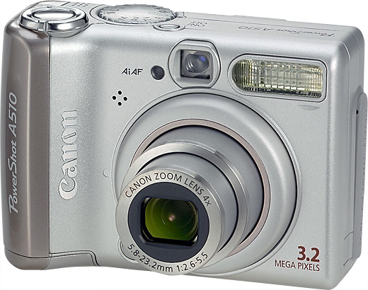

# Canon A510 Webcam on Linux using gphoto2



This project provides a script to use a Canon PowerShot A510 camera as a webcam on Linux. It uses `gphoto2` to capture a live preview stream and `ffplay` to display it.

## Prerequisites

Before you begin, ensure you have the following dependencies installed.

### For Debian/Ubuntu based distributions

```bash
sudo apt update
sudo apt install gphoto2 libgphoto2-dev ffmpeg
```

### For Arch Linux based distributions

```bash
sudo pacman -Syu gphoto2 libgphoto2 ffmpeg
```

## Usage

1. **Connect your camera** to your computer via USB and turn it on.
2. **Run the script**

    ```bash
    ./gphoto-preview.sh
    ```

3. A window from `ffplay` should open, displaying the live feed from your camera.

### Optional: Making the script globally accessible

To run `gphoto-preview.sh` from any terminal location, you can add it to your system's `PATH`.

1.  **Move the script** to a common directory for user binaries:

    ```bash
    mkdir -p ~/.local/bin
    mv gphoto-preview.sh ~/.local/bin/
    ```

2.  **Add the directory to your `PATH`**. Add the following line to your `~/.bashrc` or `~/.zshrc` file:

    ```bash
    export PATH="$HOME/.local/bin:$PATH"
    ```

3.  **Apply the changes** by restarting your terminal or running `source ~/.bashrc` or `source ~/.zshrc`.

## How It Works

The Canon PowerShot A510, like many older digital cameras, is not recognized as a standard video device (`/dev/video*`) on Linux. This means it cannot be used directly by most applications that expect a webcam.

This script circumvents this limitation by using the `--capture-movie` feature of `gphoto2`. This command captures a continuous stream of preview frames from the camera as a motion JPEG (`.mjpg`) file. The script then uses `ffplay` (part of the FFmpeg suite) to play this file in real-time, effectively turning your camera into a live preview monitor.

## Troubleshooting

- **Camera not detected**
  Ensure the camera is properly connected and powered on. You can check if `gphoto2` detects it by running:

  ```bash
  gphoto2 --auto-detect
  ```

- **Script errors**
  Make sure all dependencies are installed correctly and that the `gphoto-preview.sh` script has execute permissions (`chmod +x gphoto-preview.sh`).

## License

This project is licensed under the terms of the LICENSE file.